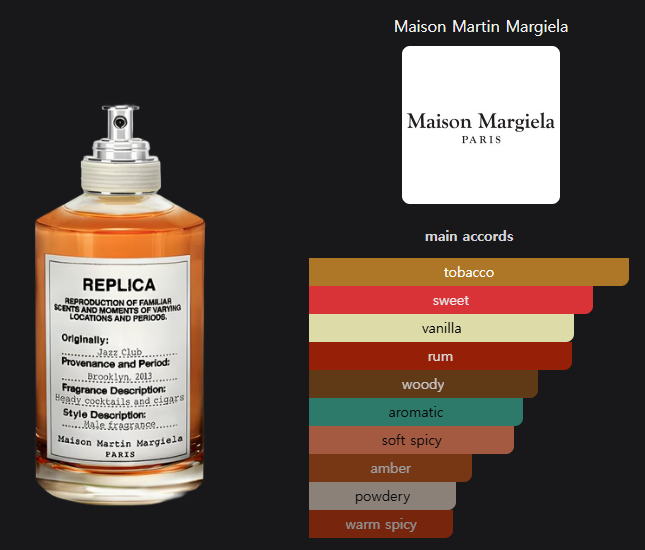

## 노트

- **톱**  — 핑크 페퍼, 네롤리, 프리모피오레 레몬 — (첫 10분)
- **미들** — 럼 앱솔루트, 자바 베티버 오일, 클라리 세이지 — (1시간 뒤)
- **베이스** — 토바코 리프(담뱃잎) 앱솔루트, 바닐라 빈, 스티랙스 레진 — (잔향)

## 시향 기록

톱은 핑크 페퍼가 톡 쏘며 올라온다. 날카롭다 싶은 순간 럼과 토바코가 받쳐주면서 스모키함과 바닐라의 단맛이 겹친다. 이 구간이 가장 좋다.

실내 기준 8시간쯤 간다. 늦가을과 겨울, 코트를 입는 계절용이다. 가슴·목뒤·팔에 세 번 정도가 적당했고, 그 이상은 공간을 다 잡아먹는다.

## 어울리는 옷

무채색 미니멀룩에 특히 잘 붙는다. 장식이 없는 옷일수록 향이 유일한
액세서리가 되는데, 재즈 클럽은 그 자리를 채울 만큼 존재감이 있으면서도
과하게 나서지 않는다. 검정이나 차콜 코트, 니트 셋업처럼 실루엣만 남은
차림에 뿌리면 공들인 티는 안 나면서 인상은 남는다.

반대로 패턴이 많거나 캐주얼한 차림에는 향만 혼자 겉돈다.

## 아쉬운 점

여름에는 못 쓴다. 무게가 그대로 남아서 덥고 답답해진다. 쓸 수 있는 계절을 반쯤 버리고 가는 향이라, 별 하나는 여기서 빠졌다.

톱도 사람을 가린다. 분사량 탓인지는 확신이 안 서는데, 가까이서 한 번에 많이 뿌리면 첫 10분 동안 머리가 아프다. 뿌리고 조금 떨어뜨려 두거나 분사 횟수를 줄이는 편이 낫다.

## 한 줄

100ml에 9만 원. 니치까지 가지 않고 디자이너 향수 안에서 고른다면 가을·겨울 향은 이게 으뜸이라고 본다. 재구매한다